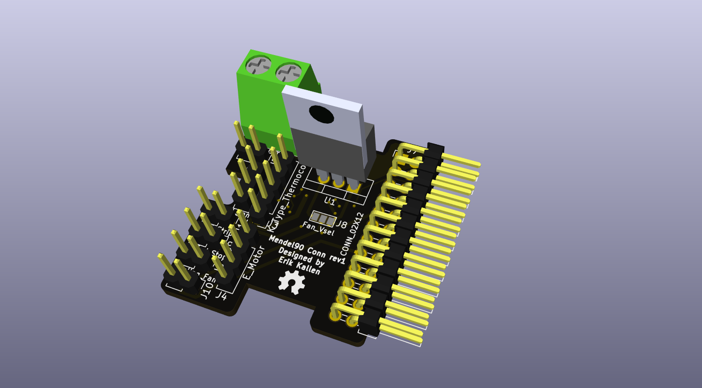

# Mendel90 connector PCB

If you happen to own a mendel90 and want a different way to connect your hotend and accesories, you could use this.

Support the following hotend goodies:

* BL touch
* Nema17 Stepper
* End stop (Same as bl touch wires)
* LED Strip
* Hotend fan
* Part cool fan (12v/5v)
* Hotend heater
* Thermocouple breakout board(Max6675/Max31855)

